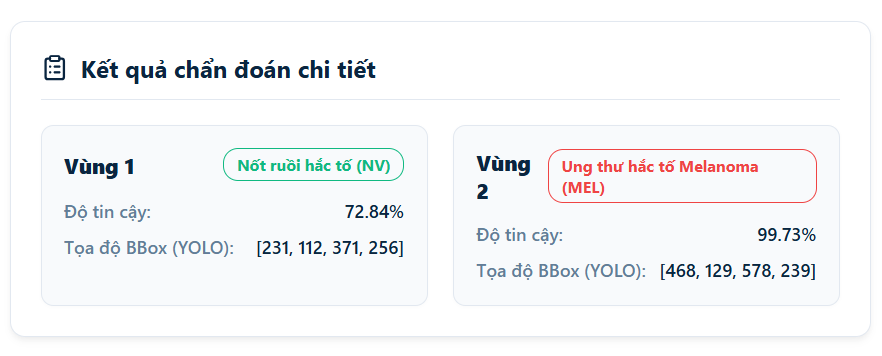
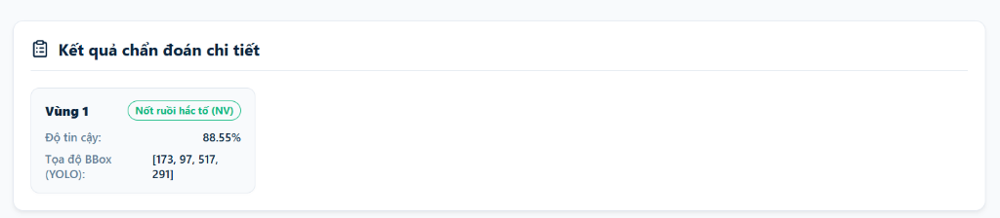

#  DermaScan AI - Skin Lesion Localization & Explainability Dashboard

**DermaScan AI** là một hệ thống hỗ trợ chẩn đoán và phân tích tổn thương da sử dụng mô hình học sâu hai giai đoạn (Two-Stage Cascade Architecture) kết hợp giải thích quyết định bằng bản đồ nhiệt độ kích hoạt (Grad-CAM Explainability). 

Hệ thống được thiết kế với giao diện Dashboard chạy trên nền tảng Next.js (React) kết hợp với FastAPI (Python) làm backend phục vụ tính toán.

---

##  Bộ dữ liệu Huấn luyện (HAM10000 Dataset)

Hệ thống sử dụng mô hình được huấn luyện trên bộ dữ liệu nghiên cứu da liễu quốc tế **Skin Cancer MNIST: HAM10000** (được lưu trữ và tải từ Kaggle/Harvard Dataverse). Cấu trúc của bộ dữ liệu bao gồm các tệp tin sau:

*   `HAM10000_images_part_1/`: Thư mục chứa phần thứ nhất của bộ ảnh da liễu gốc (dạng ảnh màu JPEG có độ phân giải gốc cao).
*   `HAM10000_images_part_2/`: Thư mục chứa phần thứ hai của bộ ảnh da liễu gốc.
*   `HAM10000_metadata.csv`: Tệp chứa thông tin thuộc tính lâm sàng của từng ca bệnh, bao gồm:
    *   `lesion_id`: Mã định danh ca bệnh tổn thương.
    *   `image_id`: Tên file ảnh tương ứng.
    *   `dx`: Nhãn chẩn đoán bệnh lý viết tắt (ví dụ: `mel`, `nv`, `bcc`,...).
    *   `dx_type`: Phương pháp xác thực lâm sàng (chụp cắt lớp, sinh thiết, ý kiến chuyên gia).
    *   `age`: Tuổi của bệnh nhân.
    *   `sex`: Giới tính của bệnh nhân.
    *   `localization`: Vị trí giải phẫu xuất hiện tổn thương trên cơ thể.
*   Tệp nén biểu diễn pixel mức thấp (phục vụ các bài toán phân loại nhanh):
    *   `hmnist_28_28_L.csv`: Tệp dữ liệu ảnh mức xám (Grayscale) kích thước 28x28 pixel được dàn phẳng (flattened) thành dạng bảng.
    *   `hmnist_28_28_RGB.csv`: Tệp dữ liệu ảnh màu (RGB) kích thước 28x28 pixel được dàn phẳng thành dạng bảng.
    *   `hmnist_8_8_L.csv`: Tệp dữ liệu ảnh mức xám kích thước 8x8 pixel dạng bảng phẳng.
    *   `hmnist_8_8_RGB.csv`: Tệp dữ liệu ảnh màu kích thước 8x8 pixel dạng bảng phẳng.

---

##  Hướng dẫn Cập nhật Mô hình sau khi Huấn luyện trên Kaggle

Sau khi hoàn thành việc huấn luyện (train) mô hình phát hiện (YOLOv8) hoặc mô hình phân loại (DenseNet121) trên môi trường điện toán đám mây Kaggle, bạn thực hiện quy trình sau để tích hợp trọng số mới vào dự án cục bộ:

### Bước 1: Tải tệp trọng số từ Kaggle
Tải xuống các tệp trọng số đầu ra (Output Weights) của phiên huấn luyện:
*   Mô hình YOLOv8: Tải file trọng số tốt nhất `best.pt`.
*   Mô hình DenseNet121: Tải file lưu trọng số mạng tốt nhất (định dạng thông thường là `.pth` hoặc `.pt`).

### Bước 2: Di chuyển trọng số vào thư mục dự án
Sao chép và thay thế các tệp tin trọng số mới vào thư mục lưu trữ weights của Backend:
*   Đối với YOLOv8: Đổi tên tệp `best.pt` thành `yolo_best.pt` và đặt vào:
    `backend/weights/yolo_best.pt`
*   Đối với DenseNet121: Đặt file trọng số phân loại (đổi tên thành `best_densenet.pth`) vào:
    `backend/weights/best_densenet.pth`

### Bước 3: Chạy kịch bản dọn dẹp và chuẩn bị không gian làm việc
Tại thư mục gốc dự án, hãy chạy lệnh sau để tự động dọn dẹp các thư mục tạm và đổi tên các file trọng số một cách an toàn:
```bash
python backend/workspace_prep.py
```

### Bước 4: Kiểm tra Pipeline cục bộ bằng Script
Chạy script kiểm tra ngoại tuyến để xác nhận các trọng số mới tương thích tốt với mã nguồn và không gây ra lỗi xử lý hình ảnh:
1. Kích hoạt môi trường ảo `venv` của backend.
2. Chạy tệp tin kiểm tra:
   ```bash
   python test_pipeline.py
   ```
*Nếu đầu ra hiển thị thông báo `✅ PIPELINE RUN COMPLETED SUCCESSFULLY WITHOUT ERRORS!` thì mô hình mới đã tương thích hoàn toàn.*

### Bước 5: Khởi động lại API Server
Tiến hành chạy lại server FastAPI để hệ thống áp dụng các mô hình mới:
```bash
python run.py
```

---

##  Công nghệ Sử dụng (Tech Stack)

### 1. Backend
*   **FastAPI**: Framework Python dùng để xây dựng các API endpoints nhận ảnh, xử lý pipeline AI và trả kết quả về client.
*   **PyTorch**: Thư viện chạy mô hình phân loại DenseNet121 và thực hiện tính toán ma trận Grad-CAM.
*   **Ultralytics YOLOv8**: Sử dụng để định vị vùng tổn thương trên da (Bounding Box).
*   **OpenCV & NumPy**: Xử lý cắt ảnh vùng tổn thương, vẽ khung tọa độ, áp dụng colormap JET cho bản đồ nhiệt và trộn ảnh (blend).
*   **Uvicorn**: ASGI web server chạy backend Python.

### 2. Frontend
*   **Next.js (React & TypeScript)**: Framework xây dựng giao diện Dashboard phía Client.
*   **Lucide React**: Thư viện icons hiển thị trên giao diện.
*   **Vanilla CSS & Inline Styles**: Định dạng phong cách giao diện mà không phụ thuộc vào thư viện CSS bên ngoài.

---

##  Hướng dẫn Cài đặt & Khởi chạy

### Bước 1: Khởi chạy Backend FastAPI (Cổng 8000)
Mở terminal và di chuyển vào thư mục `backend`:
```bash
cd backend

# 1. Tạo môi trường ảo (venv) nếu chưa có
python -m venv venv

# 2. Kích hoạt môi trường ảo:
# - Windows PowerShell:
.\venv\Scripts\Activate.ps1
# - Windows Command Prompt (CMD):
venv\Scripts\activate
# - Git Bash / Linux / macOS:
source venv/Scripts/activate

# 3. Cài đặt các thư viện cần thiết
pip install -r requirements.txt

# 4. Khởi chạy server FastAPI
python run.py
```
*API server hoạt động tại địa chỉ: `http://127.0.0.1:8000`*

### Bước 2: Khởi chạy Frontend Next.js (Cổng 3000)
Mở một cửa sổ terminal mới và di chuyển vào thư mục `frontend`:
```bash
cd frontend

# 1. Cài đặt các thư viện Node.js
npm install

# 2. Chạy ứng dụng ở chế độ phát triển
npm run dev
```
*Giao diện Dashboard hoạt động tại địa chỉ: `http://localhost:3000`*

---

##  Công việc Thực hiện & Phương pháp Triển khai

Dưới đây là chi tiết các hạng mục công việc đã thực hiện và phương pháp xử lý kỹ thuật tương ứng qua các giai đoạn phát triển của dự án:

| Giai đoạn | Công việc thực hiện | Phương pháp triển khai & Chi tiết kỹ thuật |
| :--- | :--- | :--- |
| **Giai đoạn 1: Core Pipeline & Kết nối** | Phát hiện tổn thương da (Stage 1) | Tích hợp mô hình YOLOv8 tải từ file trọng số `yolo_best.pt`. Viết mã nguồn trích xuất tọa độ Bounding Box, điểm tin cậy (confidence score) và chỉ số lớp (class index) từ ảnh đầu vào. |
| **Giai đoạn 1: Core Pipeline & Kết nối** | Phân loại bệnh lý da liễu (Stage 2) | Thiết lập tiền xử lý: cắt ảnh vùng tổn thương dựa trên tọa độ YOLOv8, chuẩn hóa kích thước về `224x224`, chuyển thành Tensor và thực hiện chuẩn hóa dữ liệu theo ImageNet. Đưa ảnh qua mô hình DenseNet121 load từ file `best_densenet.pth` để dự đoán 1 trong 7 lớp bệnh lý của tập dữ liệu HAM10000. |
| **Giai đoạn 1: Core Pipeline & Kết nối** | Giải thích quyết định bằng Grad-CAM | Tạo lớp `GradCAMEngine` trong `gradcam_engine.py` để trích xuất bản đồ kích hoạt (activations) tại lớp tích chập cuối cùng (`features.norm5` của DenseNet121). Để tránh lỗi xung đột với các phép tính ReLU biến đổi tại chỗ (inplace), chuyển sang đăng ký **Tensor-level hook** (`register_hook`) trực tiếp trên tensor đầu ra của lớp, đồng thời gọi `.clone()` để nhân bản các tensor activations và gradients. Dùng `.detach()` ngắt đồ thị đạo hàm trước khi chuyển sang định dạng NumPy array. |
| **Giai đoạn 1: Core Pipeline & Kết nối** | Xây dựng API và giải quyết CORS | Viết endpoint chính `/api/analyze` trong `main.py` nhận ảnh tải lên dưới dạng Multipart file, gọi tuần tự YOLOv8 và DenseNet121 để xử lý, vẽ khung nhãn và trộn bản đồ nhiệt bằng OpenCV Colormap JET, sau đó mã hóa Base64 trả về client. Cấu hình `allow_origins=["*"]` trên `CORSMiddleware` của FastAPI để cho phép client từ cổng 3000 gọi trực tiếp sang cổng 8000. |
| **Giai đoạn 2: Tối ưu UI/UX & Tham số** | Tái thiết kế bố cục hiển thị | Thay đổi bố cục cũ bằng cách tách khung "Kết quả chẩn đoán chi tiết" thành một hàng riêng biệt nằm ngang ở bên dưới. Hàng phía trên hiển thị song song ảnh gốc của người dùng tải lên và ảnh chẩn đoán (Grad-CAM overlay) để phục vụ đối chiếu trực quan. |
| **Giai đoạn 2: Tối ưu UI/UX & Tham số** | Trình bày kết quả dạng lưới | Hiển thị thông tin chẩn đoán chi tiết dưới dạng các thẻ (cards) xếp trong lưới CSS Grid. Thiết lập chiều rộng tối thiểu cho mỗi thẻ là `280px` (`minmax(280px, 1fr)`) để tự động co giãn đều đặn trên cả tab Soi da và xem chi tiết Lịch sử bệnh án. Thêm thuộc tính CSS `whiteSpace: 'nowrap'` cho tiêu đề vùng và tên nhãn y khoa để ngăn chặn hiện tượng bẻ dòng văn bản. |
| **Giai đoạn 2: Tối ưu UI/UX & Tham số** | Tinh giản luồng hoạt động | Loại bỏ thanh trượt điều chỉnh độ mờ (opacity slider) tại giao diện frontend và API trộn ảnh `/api/blend`. Giao diện sử dụng ảnh kết quả đã được trộn sẵn ở backend với tỷ lệ `alpha = 0.5` để giảm số lượng request liên tục và tăng tốc độ hiển thị giao diện. |
| **Giai đoạn 2: Tối ưu UI/UX & Tham số** | Quản lý tham số mô hình tập trung | Đưa tham số `YOLO_CONF_THRESHOLD = 0.25` và `YOLO_BBOX_PADDING = 0.0` vào file cấu hình `backend/app/config.py` để dễ dàng tinh chỉnh hiệu năng phát hiện mà không cần sửa đổi mã nguồn xử lý ảnh. |
| **Giai đoạn 3: Phân tách Đa tổn thương & Tối ưu hóa** | Giải thuật tự động tách Bounding Box | Thiết lập giải thuật hậu xử lý lai kết hợp YOLOv8 và Phân đoạn Cường độ ảnh xám (Intensity Segmentation) kết hợp Phép đóng Hình thái học (Morphological Closing 5x5). Giải thuật tự động phát hiện khi nhiều nốt bị gộp chung vào 1 BBox và tách thành các BBox con riêng biệt chính xác bao quanh từng tổn thương. |
| **Giai đoạn 3: Phân tách Đa tổn thương & Tối ưu hóa** | Tự động làm khít Bounding Box lỏng | Khi BBox phát hiện của YOLOv8 lỏng lẻo hoặc cắt lệch tổn thương, thuật toán sử dụng đường bao phân đoạn để tự động điều chỉnh tọa độ Bounding Box ôm khít hoàn toàn nốt tổn thương. |
| **Giai đoạn 3: Phân tách Đa tổn thương & Tối ưu hóa** | Nâng cao tương phản Grad-CAM | Tích hợp hiệu chỉnh Gamma (Gamma Correction với $\gamma = 2.0$) vào engine sinh bản đồ nhiệt. Phép lũy thừa hóa giúp tập trung cường độ màu đỏ nóng cực đại vào nhân đậm màu nguy hiểm của tổn thương, đồng thời triệt tiêu nhiễu kích hoạt mờ ở vùng da lành xung quanh. |
| **Giai đoạn 3: Phân tách Đa tổn thương & Tối ưu hóa** | Nâng cấp mô hình phát hiện và phân loại | Nâng cấp lên bộ trọng số V2 được huấn luyện lại trên tập dữ liệu đầy đủ từ Kaggle: thay thế mô hình YOLOv8n mặc định bằng YOLOv8x lớn và tinh chỉnh DenseNet121, cải thiện đáng kể độ chính xác định vị và phân loại. |

---

##  Kết quả Thực tế & Giải thuật Tách Bounding Box (Multi-Lesion Splitting & Refinement)

### 1. Thách thức lâm sàng
Mô hình YOLOv8 được huấn luyện trên bộ dữ liệu da liễu HAM10000 (vốn chứa hầu hết các bức ảnh macro chụp cận cảnh một tổn thương duy nhất). Khi áp dụng vào thực tế với ảnh chụp lâm sàng góc rộng chứa nhiều tổn thương rải rác gần nhau, YOLOv8 có xu hướng nhóm toàn bộ các nốt da này vào **một Bounding Box duy nhất**. Điều này dẫn đến chẩn đoán sai lệch hoặc bỏ sót các nốt bệnh lý nguy hiểm.

### 2. Giải pháp kỹ thuật: Thuật toán Hậu xử lý lai (Hybrid Post-processing)
Để giải quyết triệt để vấn đề này mà không cần tốn chi phí gán nhãn lại dữ liệu, hệ thống tích hợp giải thuật hậu xử lý lai kết hợp giữa Học máy (YOLOv8) và Thị giác máy tính truyền thống (Computer Vision) ngay tại Backend:

1. **Phát hiện vùng nghi ngờ (YOLOv8)**: YOLOv8 quét và đưa ra BBox bao quát vùng da chứa các nốt tổn thương.
2. **Cắt ảnh & Chuyển đổi xám**: Vùng ảnh bên trong BBox được cắt ra (crop) và chuyển sang không gian màu Grayscale.
3. **Phân đoạn dựa trên độ sáng (Intensity Segmentation)**: Làm mịn bằng Gaussian Blur (5x5) để lọc bớt nhiễu và lông tơ, sau đó áp dụng ngưỡng nhị phân nghịch đảo (Inverse Thresholding với ngưỡng động `125` cấu hình tại `config.py`) tận dụng đặc điểm các nốt tổn thương luôn tối màu hơn da lành xung quanh.
4. **Phép đóng hình thái học (Morphological Closing)**: Áp dụng phép đóng với hạt nhân hình elip kích thước `5x5` để lấp đầy các phản sáng màu trắng bên trong nốt (ví dụ: phản quang ánh đèn chụp) và kết nối các mảng đứt gãy của cùng một nốt.
5. **Tìm đường bao & Phân tách BBox**: Tìm các contours độc lập. Nếu phát hiện số lượng đường bao hợp lệ (diện tích $\ge 300$ pixel) từ 2 trở lên, hệ thống sẽ tự động hủy bỏ BBox gộp ban đầu và sinh ra các BBox con tương ứng ôm khít từng nốt. Các nốt này sau đó được gửi độc lập sang Stage 2 (DenseNet121) để phân loại và chạy Grad-CAM riêng biệt.

---

### 3. Kết quả thử nghiệm lâm sàng thực tế

#### Trường hợp 1: Chẩn đoán nhiều tổn thương đồng thời (Multi-Lesion Detection)
Hình ảnh thực tế khi chụp vùng da chứa 3 nốt tổn thương hắc tố sắp xếp nằm ngang. BBox lớn ban đầu của YOLO đã được tách chính xác thành 3 BBox con ôm khít, chẩn đoán riêng biệt cả 3 nốt đều là **Ung thư hắc tố Melanoma (MEL)** với độ tin cậy cực cao (>95%) kèm bản đồ nhiệt tập trung chuẩn xác:



#### Trường hợp 2: Chẩn đoán tổn thương lớn kèm các nốt ruồi vệ tinh nhỏ
Hệ thống phát hiện chuẩn xác tổn thương chính là **Ung thư hắc tố Melanoma (MEL)** đồng thời gom cụm và định vị các nốt ruồi vệ tinh nhỏ xung quanh là **Nốt ruồi hắc tố lành tính (NV)** mà không bị bỏ sót hoặc gộp chung:



---

##  Quy chuẩn Màu sắc Nhãn bệnh lý (Clinical Color Schema)

Hệ thống sử dụng các màu sắc khác nhau để biểu thị mức độ nghiêm trọng của tổn thương trên viền Bounding Box và Badge nhãn:

| Nhóm bệnh lý | Nhãn hiển thị | Mức độ bệnh lý | Màu sắc hiển thị |
| :--- | :--- | :--- | :--- |
| **mel** | Ung thư hắc tố Melanoma (MEL) | Ác tính | Đỏ sẫm / Danger |
| **bcc** | Ung thư biểu mô tế bào đáy (BCC) | Ác tính | Đỏ tươi / Danger |
| **akiec** | Dày sừng quang hóa (AKIEC) | Tiền ung thư | Cam / Warning |
| **nv** | Nốt ruồi hắc tố (NV) | Lành tính | Xanh lá / Success |
| **bkl** | Dày sừng lành tính (BKL) | Lành tính | Xanh lá / Success |
| **df** | U sợi da (DF) | Lành tính | Xanh lá / Success |
| **vasc** | Tổn thương mạch máu (VASC) | Lành tính | Xanh lá / Success |

---

##  Tài liệu Endpoints API

### 1. Phân tích hình ảnh: `POST /api/analyze`
*   **Tham số (Form Data)**:
    *   `file`: File ảnh da cần quét.
    *   `alpha`: Hệ số độ mờ trộn màu heatmap ở backend (Mặc định: `0.5`).
*   **Phản hồi (JSON)**:
    ```json
    {
      "original_b64": "...", // Chuỗi base64 ảnh gốc
      "annotated_b64": "...", // Chuỗi base64 ảnh đã được vẽ khung và trộn heatmap
      "lesions": [
        {
          "bbox": [173, 97, 517, 291], // Tọa độ [x1, y1, x2, y2]
          "label": "Nốt ruồi hắc tố (NV)", // Nhãn tiếng Việt
          "confidence": 0.8855, // Độ tin cậy (0.0 -> 1.0)
          "heatmap_b64": "..." // Ảnh heatmap thô của riêng vùng này
        }
      ]
    }
    ```

### 2. Trộn màu: `POST /api/blend`
*   **Tham số (JSON Body)**:
    *   `original_b64`: Ảnh gốc dạng base64.
    *   `bboxes`: Mảng tọa độ các bounding boxes.
    *   `heatmaps_b64`: Mảng các ảnh heatmap thô dạng base64.
    *   `labels`: Danh sách chuỗi nhãn bệnh kèm tỷ lệ tin cậy.
    *   `alpha`: Độ mờ mới (`0.0` -> `1.0`).
*   **Phản hồi (JSON)**:
    ```json
    {
      "blended_b64": "..." // Chuỗi base64 ảnh kết quả đã trộn màu mới
    }
    ```

---

##  Cấu trúc thư mục

```
dermascan-ai/
├── docs/                            # Tài liệu dự án và hình ảnh minh họa
│   └── assets/                      # Ảnh kết quả chẩn đoán lâm sàng thực tế
├── backend/                         # Backend Python (FastAPI + AI Models)
│   ├── app/                         # Mã nguồn ứng dụng chính
│   │   ├── services/                # Các dịch vụ phân tích AI độc lập
│   │   │   ├── densenet_classifier.py # Phân loại và tiền xử lý (DenseNet121)
│   │   │   ├── gradcam_engine.py    # Engine trích xuất Grad-CAM qua Tensor Hook
│   │   │   ├── yolo_detector.py     # Phát hiện vùng nghi tổn thương (YOLOv8)
│   │   │   └── __init__.py
│   │   ├── utils/
│   │   │   ├── image_helper.py      # Xử lý cắt ảnh, vẽ BBox và trộn bản đồ màu JET
│   │   │   └── __init__.py
│   │   ├── config.py                # Cấu hình ngưỡng lọc tin cậy YOLO, nhãn HAM10000
│   │   ├── main.py                  # API endpoints, cấu hình Middleware CORS
│   │   └── __init__.py
│   ├── weights/                     # Chứa các file trọng số của mô hình AI
│   │   ├── yolo_best.pt             # Trọng số mô hình YOLOv8 (V2 tối ưu)
│   │   ├── best_densenet.pth        # Trọng số mô hình DenseNet121 (V2 tối ưu)
│   │   └── classes.json             # File ánh xạ nhãn
│   ├── run.py                       # Điểm khởi chạy ASGI server FastAPI
│   └── test_pipeline.py             # Script kiểm tra pipeline chẩn đoán ngoại tuyến
│
├── frontend/                        # Frontend Dashboard (Next.js + TypeScript)
│   ├── src/                         # Thư mục chứa mã nguồn ứng dụng
│   │   ├── app/                     # Next.js App Router, layout và styles
│   │   │   ├── globals.css          # Định nghĩa biến CSS và styles toàn cục
│   │   │   ├── layout.tsx           # Layout nền tảng ứng dụng
│   │   │   └── page.tsx             # Trang Dashboard chính (Chứa tab Soi da & Lịch sử)
│   │   └── components/              # Các UI Components lắp ghép
│   │       ├── Header.tsx           # Tiêu đề ứng dụng
│   │       ├── ImageUploader.tsx    # Nơi kéo thả tải ảnh lên
│   │       ├── ResultPanel.tsx      # Khung hiển thị ảnh kết quả chẩn đoán và chú thích màu sắc
│   │       └── Sidebar.tsx          # Thanh menu điều hướng bên trái
│   ├── next.config.js               # File cấu hình Next.js
│   ├── package.json                 # Quản lý dependencies và scripts chạy ứng dụng
│   └── tsconfig.json                # Cấu hình trình biên dịch TypeScript
│
├── notebooks/                       # Thư mục lưu trữ tài liệu nghiên cứu thử nghiệm
│   └── test_pipeline.ipynb          # Jupyter Notebook chạy thử nghiệm pipeline
│
├── .gitignore                       # Danh sách các tệp loại trừ không đưa lên Git
└── requirements.txt                 # Quản lý thư viện Python chung cho toàn dự án
```
