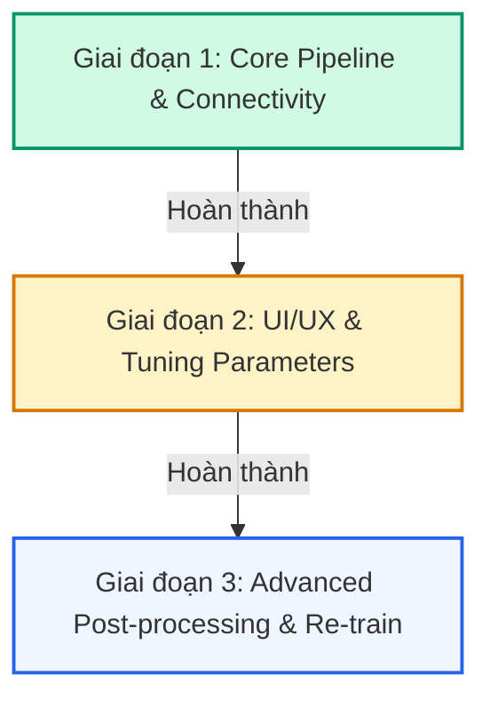

# 🩺 DermaScan AI - Skin Lesion Localization & Explainability Dashboard

**DermaScan AI** là một hệ thống y tế kỹ thuật số tiên tiến, hỗ trợ các bác sĩ lâm sàng và nghiên cứu viên trong việc phát hiện, định vị và chẩn đoán phân biệt các tổn thương da. Hệ thống áp dụng mô hình học máy hai giai đoạn (**Two-Stage Cascade Architecture**) kết hợp cơ chế giải thích quyết định lâm sàng bằng bản đồ nhiệt độ kích hoạt (**Grad-CAM Explainability**).

Dự án được xây dựng với một giao diện Dashboard chuyên nghiệp, hiện đại, mang phong cách y tế - công nghệ cao, hoạt động mượt mà, tối ưu hóa độ trễ kết nối và hiển thị.

---

## 🛠️ Công nghệ Sử dụng (Tech Stack)

### 1. Backend (Trí tuệ nhân tạo & API Service)
*   **FastAPI (Python)**: Framework hiệu năng cao để xây dựng RESTful API xử lý logic phân tích ảnh.
*   **PyTorch**: Framework học sâu chạy nền tảng mô hình phân loại **DenseNet121** và tính toán bản đồ nhiệt **Grad-CAM**.
*   **Ultralytics YOLOv8**: Framework phát hiện đối tượng thời gian thực tối tân dùng cho việc định vị bounding box tổn thương da.
*   **OpenCV & NumPy**: Thư viện xử lý ma trận điểm ảnh, cắt (crop) ảnh tổn thương, vẽ khung chẩn đoán và trộn màu nhiệt (overlay blend).
*   **Uvicorn**: ASGI web server chạy backend Python.

### 2. Frontend (Giao diện Người dùng)
*   **Next.js 14+ (React & TypeScript)**: Framework xây dựng ứng dụng web phía client chuyên nghiệp và an toàn.
*   **Lucide React**: Bộ icon vector thiết kế tối giản, sắc nét.
*   **Vanilla CSS & Inline Styles**: Phong cách thiết kế giao diện tùy biến (custom CSS), tối ưu hóa tốc độ tải trang, giảm thiểu phụ thuộc thư viện ngoài giúp giao diện chạy mượt mà và an toàn.

---

## ⚙️ Hướng dẫn Cài đặt & Khởi chạy

Dự án yêu cầu máy tính đã cài đặt sẵn **Python 3.9+** và **Node.js 18+**.

### Bước 1: Khởi chạy Backend FastAPI (Cổng 8000)
Mở terminal và di chuyển vào thư mục `backend`:
```bash
cd backend

# 1. Tạo môi trường ảo (venv) nếu chưa có
python -m venv venv

# 2. Kích hoạt môi trường ảo (chọn lệnh phù hợp với shell của bạn):
# - Dành cho Windows PowerShell:
.\venv\Scripts\Activate.ps1
# - Dành cho Windows Command Prompt (CMD):
venv\Scripts\activate
# - Dành cho Git Bash / Linux / macOS:
source venv/Scripts/activate

# 3. Cài đặt các thư viện cần thiết
pip install -r requirements.txt

# 4. Khởi chạy server FastAPI
python run.py
```
*API server sẽ hoạt động ổn định tại địa chỉ: `http://127.0.0.1:8000`*

### Bước 2: Khởi chạy Frontend Next.js (Cổng 3000)
Mở một cửa sổ terminal mới và di chuyển vào thư mục `frontend`:
```bash
cd frontend

# 1. Cài đặt các thư viện Node.js
npm install

# 2. Chạy ứng dụng ở chế độ phát triển (Development Mode)
npm run dev
```
*Giao diện Dashboard y tế sẽ hoạt động tại địa chỉ: `http://localhost:3000`*

---

## 📈 Lộ trình & Các Giai đoạn Thực hiện (Roadmap)

Dự án được triển khai theo quy trình chuyên nghiệp gồm 3 giai đoạn chính:



### Giai đoạn 1: Thiết lập Core Pipeline & Kết nối Kết cấu (ĐÃ HOÀN THÀNH)
*   **Xây dựng mô hình YOLOv8**: Huấn luyện/tải mô hình phát hiện tổn thương da (`yolo_best.pt`) để vẽ Bounding Box bao quanh vùng da nghi nhiễm sắc tố.
*   **Phân loại bệnh lý HAM10000**: Tích hợp mô hình DenseNet121 (`best_densenet.pth`) phân loại ảnh con thành 7 nhóm bệnh lý da liễu khác nhau.
*   **Sinh bản đồ nhiệt Grad-CAM**: Thiết lập Hook bắt kích hoạt (activations) và đạo hàm (gradients) từ lớp tích chập cuối cùng để vẽ heatmap y khoa.
*   **Khắc phục lỗi nghiêm trọng (PyTorch Autograd Crash)**: 
    *   *Vấn đề*: PyTorch báo lỗi `BackwardHookFunction is a view and is being modified inplace` do lớp tích chập cuối cùng của DenseNet thực hiện các phép ReLU biến đổi tại chỗ (in-place modification).
    *   *Giải pháp*: Viết lại engine Grad-CAM sử dụng **Tensor-level hook** (`register_hook`) kết hợp với việc sao chép Tensor độc lập (`.clone()`) và tách khỏi đồ thị đạo hàm trước khi đổi sang Numpy (`.detach()`). Lỗi biên dịch 500 được giải quyết triệt để.
*   **Khắc phục lỗi CORS & Kết nối API**: Cấu hình lại hoàn toàn CORS middleware trên FastAPI sang chế độ mở (`allow_origins=["*"]`, `allow_credentials=False`) để giải quyết lỗi chặn kết nối chéo cổng giữa `localhost:3000` và `127.0.0.1:8000`.

### Giai đoạn 2: Tối ưu hóa UI/UX & Cân bằng Tham số (ĐÃ HOÀN THÀNH)
*   **Tái cấu trúc bố cục Dashboard**:
    *   *Cũ*: Cột hiển thị kết quả chẩn đoán chi tiết bị nhồi nhét vào sidebar hoặc cột nhỏ bên phải gây chật chội và đè chữ.
    *   *Mới*: Thiết kế lại bố cục thành 2 hàng: **Hàng 1** gồm Ảnh gốc + Ảnh bản đồ chẩn đoán (nằm song song). **Hàng 2** là khung kết quả chẩn đoán chi tiết trải dài toàn bộ chiều ngang màn hình (full-width) theo dạng lưới (Grid Cards).
*   **Ngăn chặn lỗi hiển thị văn bản y khoa**:
    *   Áp dụng thuộc tính CSS `whiteSpace: 'nowrap'` cho tên vùng (ví dụ: `Vùng 2`) và nhãn y khoa (ví dụ: `Ung thư hắc tố Melanoma (MEL)`), ngăn chặn việc văn bản bị bẻ dòng xấu.
    *   Giảm kích thước cỡ chữ từ `0.8rem` xuống `0.75rem` và tăng chiều rộng tối thiểu của mỗi thẻ lưới lên `280px` để tối ưu hóa không gian hiển thị trên cả tab Soi da lẫn tab Lịch sử bệnh án.
*   **Tinh giản tính năng Opacity**: Loại bỏ thanh trượt độ mờ cảm nhiệt ở phía client để giảm thiểu độ trễ phản hồi, giảm thiểu số lượng API gọi liên tiếp làm nghẽn luồng xử lý và tối ưu hóa trải nghiệm mượt mà của Dashboard.
*   **Cấu hình tham số YOLOv8 tập trung**: Đưa hai tham số quan trọng `YOLO_CONF_THRESHOLD = 0.25` và `YOLO_BBOX_PADDING = 0.0` vào tệp `backend/app/config.py` để thuận tiện tinh chỉnh mô hình mà không cần can thiệp sâu vào mã nguồn.

### Giai đoạn 3: Hậu xử lý Nâng cao & Huấn luyện lại Hệ thống (ĐỀ XUẤT)
*   **Giải quyết lỗi Bỏ sót Tổn thương (False Negative)**: Phát triển bộ hậu xử lý chẩn đoán kết hợp (Hybrid post-processing):
    *   *Grad-CAM Recovery*: Chạy Grad-CAM trên toàn bộ bức ảnh lớn (không dùng BBox). Nếu phát hiện điểm nóng kích hoạt (hot spot) có giá trị cao nằm ngoài các BBox của YOLOv8, thuật toán sẽ tự động sinh thêm một Bounding Box mới bao quanh điểm đó và gửi đi chẩn đoán phân loại.
*   **Nâng cấp mô hình YOLO**: Thay thế mô hình `YOLOv8n` (6.2MB) hiện tại bằng các mô hình có kích thước lớn hơn như `YOLOv8m` hoặc `YOLOv8l` nhằm gia tăng độ chính xác trong định vị tổn thương da phức tạp.

---

## 🎨 Quy chuẩn Màu sắc Nhãn bệnh lý (Clinical Color Schema)

Hệ thống phân định độ nghiêm trọng của tổn thương da qua màu sắc của viền Bounding Box và Badge nhãn hiển thị:

| Nhóm bệnh lý | Nhãn y khoa (HAM10000) | Mức độ nghiêm trọng | Màu sắc hiển thị |
| :--- | :--- | :--- | :--- |
| **mel** | Ung thư hắc tố Melanoma | 🔴 Nguy hiểm (Ác tính) | Đỏ sẫm / Danger |
| **bcc** | Ung thư biểu mô tế bào đáy | 🔴 Nguy hiểm (Ác tính) | Đỏ tươi / Danger |
| **akiec** | Dày sừng quang hóa | 🟡 Cảnh báo (Tiền ung thư) | Cam / Warning |
| **nv** | Nốt ruồi hắc tố | 🟢 An toàn (Lành tính) | Xanh lá / Success |
| **bkl** | Dày sừng lành tính | 🟢 An toàn (Lành tính) | Xanh lá / Success |
| **df** | U sợi da | 🟢 An toàn (Lành tính) | Xanh lá / Success |
| **vasc** | Tổn thương mạch máu | 🟢 An toàn (Lành tính) | Xanh lá / Success |

---

## 📝 Mô tả Chi tiết Endpoints API

### 1. Phân tích tổn thương da: `POST /api/analyze`
*   **Mô tả**: Tải ảnh thô lên, chạy qua pipeline phát hiện YOLOv8, cắt ảnh vùng tổn thương và chạy qua DenseNet121 cùng Grad-CAM để sinh ảnh chẩn đoán và dữ liệu chi tiết.
*   **Tham số (Form Data)**:
    *   `file`: File ảnh da chụp định dạng `.jpg`, `.png`, hoặc `.jpeg`.
    *   `alpha`: Hệ số độ mờ trộn màu heatmap ở backend (Mặc định: `0.5`).
*   **Phản hồi (JSON)**:
    ```json
    {
      "original_b64": "...", // Chuỗi base64 ảnh gốc
      "annotated_b64": "...", // Chuỗi base64 ảnh đã được vẽ BBox và trộn heatmap
      "lesions": [
        {
          "bbox": [173, 97, 517, 291], // Tọa độ [x1, y1, x2, y2]
          "label": "Nốt ruồi hắc tố (NV)", // Nhãn tiếng Việt
          "confidence": 0.8855, // Độ tin cậy (0.0 -> 1.0)
          "heatmap_b64": "..." // Ảnh heatmap thô của riêng vùng này (dạng base64)
        }
      ]
    }
    ```

### 2. Trộn màu thủ công: `POST /api/blend`
*   **Mô tả**: Endpoint phụ trợ cho phép phối ghép ảnh gốc và các ảnh bản đồ nhiệt grayscale theo tỷ lệ alpha tùy ý.
*   **Tham số (JSON Body)**:
    *   `original_b64`: Ảnh gốc dạng base64.
    *   `bboxes`: Mảng tọa độ các bounding boxes.
    *   `heatmaps_b64`: Mảng các ảnh heatmap thô dạng base64.
    *   `labels`: Danh sách chuỗi nhãn bệnh kèm tỷ lệ tin cậy.
    *   `alpha`: Độ mờ mới (`0.0` -> `1.0`).
*   **Phản hồi (JSON)**:
    ```json
    {
      "blended_b64": "..." // Chuỗi base64 ảnh kết quả đã trộn màu mới
    }
    ```

---

## 🗂️ Cấu trúc thư mục Chi tiết

```
dermascan-ai/
├── backend/                         # Backend Python (FastAPI + AI Models)
│   ├── app/                         # Mã nguồn ứng dụng chính
│   │   ├── main.py                  # API endpoints, cấu hình Middleware CORS
│   │   ├── config.py                # Cấu hình ngưỡng lọc tin cậy YOLO, nhãn HAM10000
│   │   ├── services/                # Các dịch vụ phân tích AI độc lập
│   │   │   ├── yolo_detector.py     # Phát hiện vùng nghi tổn thương (YOLOv8)
│   │   │   ├── densenet_classifier.py # Phân loại và xử lý tiền xử lý (DenseNet121)
│   │   │   └── gradcam_engine.py    # Engine trích xuất và tính toán Grad-CAM qua Tensor Hook
│   │   └── utils/
│   │       └── image_helper.py      # Xử lý cắt ảnh có padding, vẽ BBox và trộn bản đồ màu JET
│   ├── weights/                     # Chứa các file trọng số của mô hình AI (.pt, .pth)
│   ├── requirements.txt             # Danh sách thư viện Python cần cài đặt
│   └── run.py                       # Điểm khởi chạy ASGI server
│
├── frontend/                        # Frontend Dashboard (Next.js + TypeScript)
│   ├── src/                         # Thư mục chứa mã nguồn ứng dụng
│   │   ├── app/                     # Next.js App Router, layout và global styles
│   │   │   ├── page.tsx             # Trang Dashboard chính (Chứa tab Soi da & Lịch sử)
│   │   │   └── layout.tsx           # Layout nền tảng ứng dụng
│   │   └── components/              # Các UI Components lắp ghép
│   │       ├── Header.tsx           # Tiêu đề ứng dụng
│   │       ├── Sidebar.tsx          # Thanh menu điều hướng bên trái
│   │       ├── ImageUploader.tsx    # Nơi kéo thả tải ảnh lên
│   │       └── ResultPanel.tsx      # Khung hiển thị ảnh kết quả chẩn đoán và chú thích màu sắc
│   ├── package.json                 # Quản lý dependencies Node.js
│   └── next.config.js               # File cấu hình cấu trúc router Next.js
│
└── requirements.txt                 # Requirements chung cho toàn bộ dự án
```
